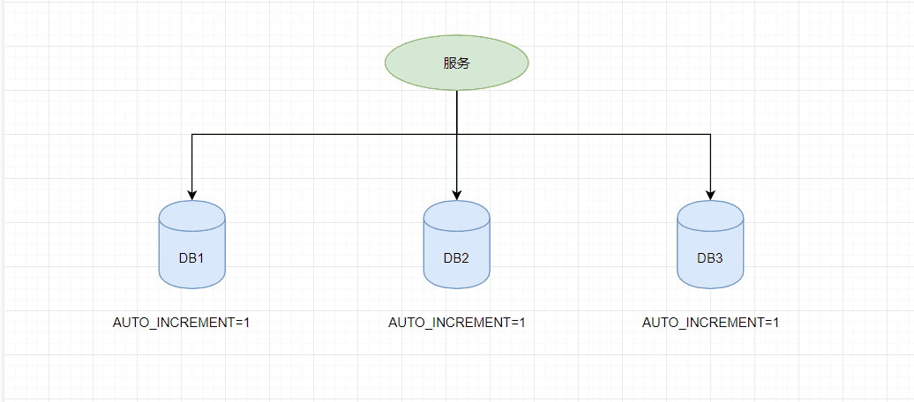

# 全局唯一ID实现方案

## 为什么需要全局唯一ID
- 传统的单体架构的时候，我们基本是单库然后业务单表的结构。每个业务表的ID一般我们都是从1增，通过AUTO_INCREMENT=1设置自增起始值，但是在分布式服务架构模式下分库分表的设计，使得多个库或多个表存储相同的业务数据。这种情况根据数据库的自增ID就会产生相同ID的情况，不能保证主键的唯一性。

- 如下图：如果第一个订单存储在 DB1 上则订单 ID 为1，当一个新订单又入库了存储在 DB2 上订单 ID 也为1。我们系统的架构虽然是分布式的，但是在用户层应是无感知的，重复的订单主键显而易见是不被允许的。那么针对分布式系统如何做到主键唯一性呢？

## 分布式ID需要满足那些条件
- 全局唯一：必须保证ID是全局性唯一的，基本要求
- 高性能：高可用低延时，ID生成响应要块，否则反倒会成为业务瓶颈
- 高可用：100%的可用性是骗人的，但是也要无限接近于100%的可用性
- 好接入：要秉着拿来即用的设计原则，在系统设计和实现上要尽可能的简单
- 趋势递增：最好趋势递增，这个要求就得看具体业务场景了，一般不严格要求

## 分布式ID的生成方式
- UUID：
  - 用法:
    - Java：String uuid = UUID.randomUUID().toString().replaceAll("-","");
  - 优点：
    - 生成足够简单，本地生成无网络消耗，具有唯一性
  - 缺点：
    - 无序的字符串，不具备趋势自增特性
    - 没有具体的业务含义
    - 长度过长16 字节128位，36位长度的字符串，存储以及查询对MySQL的性能消耗较大，MySQL官方明确建议主键要尽量越短越好，作为数据库主键 UUID 的无序性会导致数据位置频繁变动，严重影响性能。

- 基于数据库自增ID
  - 用法：
    - 基于数据库的auto_increment自增ID完全可以充当分布式ID。
  - 优点：
    - 实现简单，ID单调自增，数值类型查询速度快
  - 缺点:
    - DB单点存在宕机风险，无法扛住高并发场景

- 基于数据库集群模式
  - 用法：
    - 设置数据库的auto_increment的起始值和步长
  - 优点：
    - 解决DB单点问题
  - 缺点：
    - 不利于后续扩容，而且实际上单个数据库自身压力还是大，依旧无法满足高并发场景。

- 基于数据库的号段模式
  - 用法：
    - 号段模式可以理解为从数据库批量的获取自增ID，每次从数据库取出一个号段范围，例如 (1,1000] 代表1000个ID，具体的业务服务将本号段，生成1~1000的自增ID并加载到内存。
  - 优点：
    - 主流实现方式之一
    - 可以支持各种自定义规则
    - 对数据库影响不大
  - 缺点
    - 很多地方用到ID，数据级别很大时，需要分表维护号段。

- 基于Redis模式
  - 用法：
    - Redis也同样可以实现，原理就是利用redis的 incr命令实现ID的原子性自增。
  - 优点：
    - 不涉及到数据库，存取方便
  - 缺点：
    - RDB会定时打一个快照进行持久化，假如连续自增但redis没及时持久化，而这会Redis挂掉了，重启Redis后会出现ID重复的情况。   
    - AOF会对每条写命令进行持久化，即使Redis挂掉了也不会出现ID重复的情况，但由于incr命令的特殊性，会导致Redis重启恢复的数据时间过长。
    - 增加系统复杂程度

- 基于雪花算法（Snowflake）模式
  - 用法：
    - 各语言对应的SDK
  - 优点：
    - 雪花算法（Snowflake）是twitter公司内部分布式项目采用的ID生成算法，开源后广受国内大厂的好评，在该算法影响下各大公司相继开发出各具特色的分布式生成器。
  - 缺点：
    - 雪花算法强依赖机器时钟，如果机器上时钟回拨，会导致发号重复或者服务会处于不可用状态。如果恰巧回退前生成过一些ID，而时间回退后，生成的ID就有可能重复。官方对于此并没有给出解决方案，而是简单的抛错处理，这样会造成在时间被追回之前的这段时间服务不可用。

- 百度（uid-generator）
  - 用法：
    - 各语言对应的SDK
  - 优点：
    - 雪花算法 snowflake 的基础上做了一些改进。
    - 可以替代雪花算法

- 美团Leaf
  - 用法：
    - 基于基于数据库的号段模式
    - 提前自动先分配号段    
  - 优点：
    - 可以自定义规则
  - 缺点：
    - 仍然依赖 DB的稳定性，需要采用主从备份的方式提高 DB的可用性
    - 通过订单id号相减就能大致计算出公司一天的订单量，这个是不能忍受的。

-  薄雾算法
  - 用法：
    - 各语言对应的SDK
  - 优点：
    - 相比 snowflake ，薄雾算法具有更高的数值上限和更长的使用期限。
  - 缺点：
    - 可能产生重复
    - 可以结合redis生成不重复的