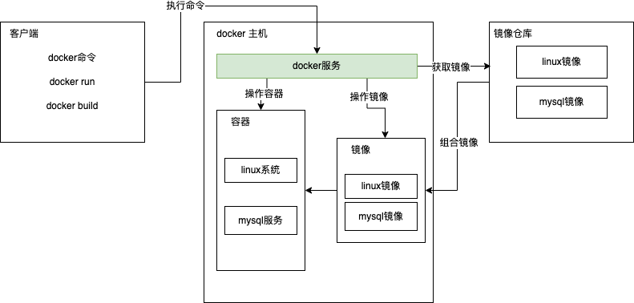

## 文档
+ [官网地址](https://docker.com/)
+ [文档地址](https://docs.docker.com/)
+ [仓库地址](https://hub.docker.com/)

## 3大要素
## 镜像(image)
+ 是一个**只读**的模板，一个独立的文件系统，包括运行容器所需的数据，可以用来创建新的容器。
+ docker提供了一个很简单的机制来创建镜像或更新现有的镜像。用户甚至可以从其他人那里下载一个已经做好的镜像直接使用。（镜像是只读的，可以理解为静态文件）
+ 一个镜像可以创建多个容器.
+ 镜像仅包含系统运行所需的的runtime环境。docker背上的集装箱。
+ 例如：Ubuntu镜像仅需170M,宿主机可以部署100~1000个容器。

### 容器(container)
+ 容器(container)的定义和镜像(image)几乎一模一样，也是一堆层的统一视角，唯一区别在于容器的最上面那一层是可读可写的。
+ 运行中的镜像称为容器。

### 仓库(repository)
+ 是存放镜像的地方
+ 类似npm,maven,composer,github
+ docker提供的官方镜像位置

### 架构图(入门版)

## docker运行原理
1. 用户是使用Docker Client与Docker Daemon建立通信，并发送请求给后者。
2. Docker Daemon作为Docker架构中的主体部分，首先提供Docker Server的功能使其可以接受Docker Client的请求。
3. Docker Engine执行Docker内部的一系列工作，每一项工作都是以一个Job的形式的存在。
4. Job的运行过程中，当需要容器镜像时，则从Docker Registry中下载镜像，并通过镜像管理驱动Graph driver将下载镜像以Graphe的形式存储。
5. 当需要为Docker创建网络环境时，通过网络管理驱动Network driver创建并配互Docker容器网络环境。
6. 当需要限制Docker容器运行资源或执行用户指令等操作时，则通过Exec driver来完成。
7. Libcontainer是一项独立的容器管理包，Network driver以及Exec driver都是通过Libcontainer来实现具体对容器进行的操作。
