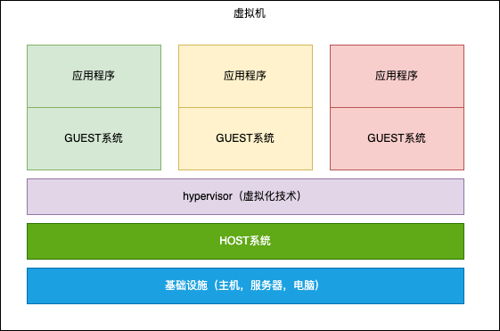
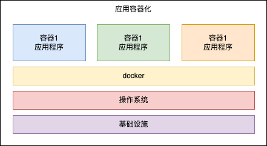

# 虚拟机与容器

## 1、什么是虚拟机
+ 虚拟机(virtual machine)就是带环境安装的一种方案。
+ 虚拟机可以在一个操作系统里面安装另一个操作系统，例如window11里面安装ubuntu系统。应用程序(App)对此毫无感知，因为虚拟机看上去跟真实系统一样。而对于底层系统来说，虚拟机就是一个普通文件，不需要就删掉，对其他部分毫无影响。
+ 常用虚拟机使用工具：[virtualBox](https://www.virtualbox.org)和[vmWare](https://www.vmware.com/products/workstation-player.html)。
+ 虚拟机架构图

### 优点
+ 虚拟机可减少在服务器设备上的支出，可以利用一个物理服务器资源切分成多个独立的虚拟机来完成许多工作。
+ 由于只有一台主机，因此可以利用虚拟机管理程序的集中功能高效地管理所有虚拟环境。这些系统完全相互独立，这意味着你可以在不同的虚拟机里安装不同的系统环境。
+ 最重要的是，虚拟机与主机操作系统隔离，是进行实验和开发应用程序的安全场所。

### 缺点
+ 虚拟机可能占用主机的大量系统资源，虚拟机的大小为数GB。在虚拟服务器上运行单个应用程序意味着还要运行Guest OS以及Guest OS运行所需的所有硬件的虚拟副本。这样很快就增加了很多RAM和CPU资源消耗。
+ 迁移虚拟机上运行的应用程序的过程也可能很复杂，因为它始终附加在操作系统上。因此，必须同时迁移应用程序和操作系统。同样，在创建虚拟机时，系统管理程序会分配专用于VM的硬件资源。 不过与运行单独的实体服务器相比，这仍然是经济的。

## 2、什么是容器
+ 容器是一个不依赖于操作系统，运行应用程序的环境。它通过Linux的Namespaces和Cgroups技术对应用程序进程进行隔离和限制的，Namespace的作用是隔离，它让应用进程只能看到该Namespace内的世界；而Cgroups 的作用是限制分配给进程的宿主机资源。但对于宿主机来说，这些被“隔离”了的进程跟其他进程并没有太大区别。
+ 容器只是运行在宿主机上的一种特殊的进程，多个容器之间使用的还是同一个宿主机的操作系统内核。

+ 容器架构图

## 3、对比
| | 虚拟机 | docker |
|---------|---------|---------|
|内存|大(一般>1G)|小(一般<500M)|
|启动速度|慢(一般>1min)|快(一般<10s)|
|整合程度|坏|好|