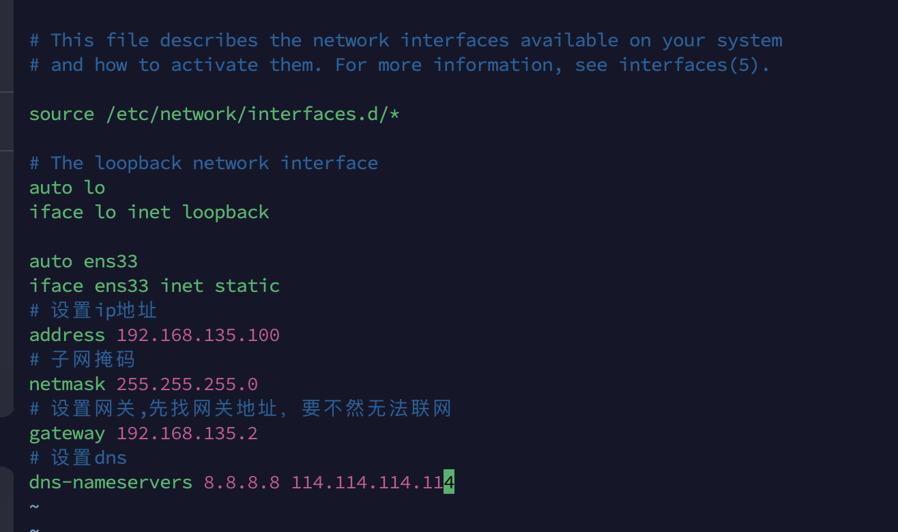

# 案例-3台机器1主2从
+ k8s版本 v1.29.2
+ [官方文档](https://kubernetes.io/zh-cn/docs/setup/production-environment/container-runtimes/)

## 系统准备
1. 准备3台服务器 安装系统:debain12
   1. 购买云服务器
   2. 使用虚拟机，当前使用虚拟机开启3个服务器。
2. 安装个人习惯的包
```bash
# 切换root用户
su root
# 更新apt 
apt update 
# 清除不再使用的包
apt autoremove
# 安装vim 个人习惯 也可以使用vi
apt -y install vim 
# 安装ssh debain的那个终端不好用。
apt -y install openssh-server
```
3. 固定3台机器IP 如何是云服务器可以不做操作
   - 配置固定IP
```bash
# 查看网络
ip addr show 
# 查看默认网关
ip route show
```
   - 参考配置

```conf
vim /etc/network/interfaces
# 将网卡ens33设置为静态IP 网卡名称可以通过ip addr show 查看
auto ens33
iface ens33 inet static
# 设置ip地址
address 192.168.135.100
# 子网掩码
netmask 255.255.255.0
# 设置网关,先找网关地址，要不然无法联网
gateway 192.168.135.2
# 设置dns
dns-nameservers 8.8.8.8 114.114.114.114
# 重启网络
sudo service networking restart
```
4. 配置服务器名称
```bash
# ip 192.168.135.100
hostnamectl set-hostname k8s-master
# ip 192.168.135.101
hostnamectl set-hostname k8s-node1
# ip 192.168.135.102
hostnamectl set-hostname k8s-node2
```
5. 配置host
```bash
vim /etc/hosts 
# 把前面的#去掉
# 192.168.135.100 k8s-master
# 192.168.135.101 k8s-node1
# 192.168.135.102 k8s-node2
# 加载配置
sudo sysctl --system 
```
6. apt换源
```bash
vim /etc/apt/sources.list 
# 阿里源 
deb https://mirrors.aliyun.com/debian/ bookworm main non-free non-free-firmware contrib
deb-src https://mirrors.aliyun.com/debian/ bookworm main non-free non-free-firmware contrib
deb https://mirrors.aliyun.com/debian-security/ bookworm-security main
deb-src https://mirrors.aliyun.com/debian-security/ bookworm-security main
deb https://mirrors.aliyun.com/debian/ bookworm-updates main non-free non-free-firmware contrib
deb-src https://mirrors.aliyun.com/debian/ bookworm-updates main non-free non-free-firmware contrib
deb https://mirrors.aliyun.com/debian/ bookworm-backports main non-free non-free-firmware contrib
deb-src https://mirrors.aliyun.com/debian/ bookworm-backports main non-free non-free-firmware contrib
# 更新配置
apt update
```

## 防火墙设置
1. 关闭防火墙
```bash
# 安装ufw 用ufw管理iptables防火墙
apt -y install ufw
#查看防火墙状态
sudo ufw status
# 启动
sudo ufw enable
# 关闭
sudo ufw disable
```
2. 不关闭防火墙
- [官方端口设置](https://kubernetes.io/zh-cn/docs/reference/networking/ports-and-protocols/)
```bash
#主节点
sudo ufw allow 22/tcp # ssh用
sudo ufw allow 6443/tcp
sudo ufw allow 2379/tcp
sudo ufw allow 2380/tcp
sudo ufw allow 10250/tcp
sudo ufw allow 10259/tcp
sudo ufw allow 10257/tcp
sudo ufw reload
#子节点
sudo ufw allow 22/tcp # ssh用
sudo ufw allow 10250/tcp
sudo ufw allow 30000:32767/tcp
sudo ufw reload
```

## 时间同步
```bash
# 安装ntpdate
apt -y install ntpdate
# 设置定时任务
crontab -e
0 */1 * * * /usr/sbin/ntpdate ntp.aliyun.com
```

## 关闭交换分区
```bash
# 临时关闭交换分区
sudo swapoff -a && sudo sed -i '/swap/d' /etc/fstab
```

## 开启转发
```bash
cat <<EOF | sudo tee /etc/modules-load.d/k8s.conf
overlay
br_netfilter
EOF
sudo modprobe overlay
sudo modprobe br_netfilter
# 设置所需的 sysctl 参数，参数在重新启动后保持不变
cat <<EOF | sudo tee /etc/sysctl.d/k8s.conf
net.bridge.bridge-nf-call-iptables  = 1
net.bridge.bridge-nf-call-ip6tables = 1
net.ipv4.ip_forward                 = 1
EOF
# 应用 sysctl 参数而不重新启动
sudo sysctl --system
```

## 容器运行时
1. [官方文档](https://kubernetes.io/zh-cn/docs/setup/production-environment/container-runtimes/)
2. 容器运行时有4个方式：
   - containerd
   - CRI-O
   - Docker Engine
   - Mirantis Container Runtime
3. 4个选择一个就行，当前选择containerd
   - 安装containerd
```bash
# 下载证书
apt -y install curl
curl -fsSL https://mirrors.aliyun.com/docker-ce/linux/debian/gpg | gpg --dearmor -o /usr/share/keyrings/docker-archive-keyring.gpg
# 配置容器镜像源
echo \
  "deb [arch=amd64 signed-by=/usr/share/keyrings/docker-archive-keyring.gpg] https://mirrors.aliyun.com/docker-ce/linux/debian \
  $(lsb_release -cs) stable" | tee /etc/apt/sources.list.d/docker.list > /dev/null
```
```bash
# 更新包
apt update
# 安装容器
apt -y install containerd
# 初始化配置
containerd config default > /etc/containerd/config.toml
vim /etc/containerd/config.toml
# 将 sandbox_image = "registry.k8s.io/pause:3.8" 调整为阿里源
sandbox_image = "registry.aliyuncs.com/google_containers/pause:3.8"
# 将 [plugins."io.containerd.grpc.v1.cri".containerd.runtimes.runc.options] 下的 SystemdCgroup = false 调整为 true
SystemdCgroup = true
# 启动containerd
# 启用并立即启动 containerd 服务
systemctl enable --now containerd.service
# 检查 containerd 服务的当前状态
systemctl status containerd.service
# 重启
systemctl restart containerd.service
# 用于检查 containerd 的版本
containerd --version
# 用于与 CRI（Container Runtime Interface）兼容的容器运行时交互的命令行工具
crictl --version
# 用于运行符合 OCI（Open Container Initiative）标准的容器
runc --version
```

## 安装 kubelet、kubectl 和 kubeadm
- kubeadm：用于引导、安装和启动 Kubernetes 集群的命令行工具，只需要简单的几个命令工具（如 init，join，upgrade，reset 等），便可以快速完成集群的维护管理工作；
- kubelet：每个节点上的代理程序，负责节点上的大部分操作，比如由它来启停容器等，节点上只有它能与 apiserver 进行通信；
- kubectl：Kubernetes 客户端工具，用来操控 Kubernetes 集群，比如查看集群中的节点信息等；
1. 添加kubernetes软件源
```bash
apt -y install apt-transport-https ca-certificates
curl https://mirrors.aliyun.com/kubernetes/apt/doc/apt-key.gpg | sudo apt-key add -
cat <<EOF | sudo tee /etc/apt/sources.list.d/kubernetes.list
deb https://mirrors.aliyun.com/kubernetes/apt/ kubernetes-xenial main
EOF
apt update
```

2. 安装
```bash
apt -y install kubelet kubeadm kubectl 
#锁定版本，不让它们自动更新
sudo apt-mark hold kubelet kubeadm kubectl
# 配置 kubelet
cat > /etc/default/kubelet << EOF
# 该参数指定了 kubelet 使用 systemd 作为容器运行时的 cgroup 驱动程序
KUBELET_EXTRA_ARGS="--cgroup-driver=systemd"
EOF
# 启动kubelet
sudo systemctl start kubelet
# 开机启动
sudo systemctl enable kubelet
# 查看版本
kubelet --version
# kubeadm 拉取镜像
kubeadm config images pull --cri-socket unix:///var/run/containerd/containerd.sock --image-repository registry.aliyuncs.com/google_containers --kubernetes-version v1.28.7
```

## 安装集群
1. 主节点 操作
```bash
# 重置配置
kubeadm reset --cri-socket unix:///var/run/containerd/containerd.sock
# kubeadm reset 报错时，可用下面的代替
rm -rf /etc/kubernetes/*    # 清除文件
rm -rf ~/.kube/*
rm -rf /var/lib/etcd/*
lsof -i :6443|grep -v "PID"|awk '{print "kill -9",$2}'|sh   #杀服务进程
lsof -i :10259|grep -v "PID"|awk '{print "kill -9",$2}'|sh
lsof -i :10257|grep -v "PID"|awk '{print "kill -9",$2}'|sh
lsof -i :10250|grep -v "PID"|awk '{print "kill -9",$2}'|sh
lsof -i :2379|grep -v "PID"|awk '{print "kill -9",$2}'|sh
lsof -i :2380|grep -v "PID"|awk '{print "kill -9",$2}'|sh
# 开启集群
sudo kubeadm init \
   --image-repository registry.aliyuncs.com/google_containers \
   --pod-network-cidr=192.168.0.0/16 \
   --cri-socket unix:///var/run/containerd/containerd.sock \
   --kubernetes-version=v1.28.7 \
   --v=5
# 查看节点信息
kubectl get nodes
# 查看集群信息
kubectl cluster-info
# 查询token
kubeadm token list
# 创建token
kubeadm token create
```
- [参数说明](https://kubernetes.io/zh-cn/docs/reference/setup-tools/kubeadm/kubeadm-init/#config-file)
  - --cri-socket 要连接的 CRI 套接字的路径。如果为空，则 kubeadm 将尝试自动检测此值； 仅当安装了多个 CRI 或具有非标准 CRI 套接字时，才使用此选项。
  - --image-repository：从阿里云服务器上拉取上面需要的基础镜像，如果不设置，就得去 Google 服务器拉取；
  - --pod-network-cidr：设置集群中Pod的网络地址段；网段要包含和前面设置3带主机的ip
  - --kubernetes-version：指定 Kubernetes 版本；
  - --v=5：显示详细的跟踪日志，
  - --apiserver-advertise-address API 服务器所公布的其正在监听的 IP 地址。请设置主节点ip。
  - --apiserver-bind-port API 服务器绑定的端口。默认值：6443
2. 子节点
```bash
# 重置配置
kubeadm reset --cri-socket unix:///var/run/containerd/containerd.sock
# 加入集群，命令在主节点获取
sudo kubeadm join 192.168.135.100:6443 --token 7zbe3t.ap3vdpxn3mgostd5 \
        --discovery-token-ca-cert-hash sha256:414a5a58422f20d49b60ce2aee2c6cd489686e730292faa7afe3286b53065dcb
```

## 安装calico网络插件
```bash
kubectl apply -f https://docs.projectcalico.org/manifests/calico.yaml
# calico 防火墙
sudo ufw allow 179/tcp
sudo ufw allow 4789/udp
sudo ufw allow 51820/udp
sudo ufw allow 51821/udp
sudo ufw allow 4789/udp
sudo ufw reload
# 检查下 Calico 的状态
kubectl get pods -n kube-system
```

## 可视化看板
```bash
# 应用配置
kubectl apply -f https://raw.githubusercontent.com/kubernetes/dashboard/v2.7.0/aio/deploy/recommended.yaml
# 启动服务
kubectl proxy
# 验证安装
kubectl get pods --all-namespaces | grep dashboard
# 创建 token
cat > dashboard-admin-user.yaml<<EOF
apiVersion: v1
kind: ServiceAccount
metadata:
  name: admin-user
  namespace: kubernetes-dashboard

---

apiVersion: rbac.authorization.k8s.io/v1
kind: ClusterRoleBinding
metadata:
  name: admin-user
roleRef:
  apiGroup: rbac.authorization.k8s.io
  kind: ClusterRole
  name: cluster-admin
subjects:
- kind: ServiceAccount
  name: admin-user
  namespace: kubernetes-dashboard
EOF
kubectl apply -f dashboard-admin-user.yaml
# 移除用户
kubectl -n kubernetes-dashboard delete serviceaccount admin-user
kubectl -n kubernetes-dashboard delete clusterrolebinding admin-user
# 查看token
kubectl -n kubernetes-dashboard create token admin-user
```

